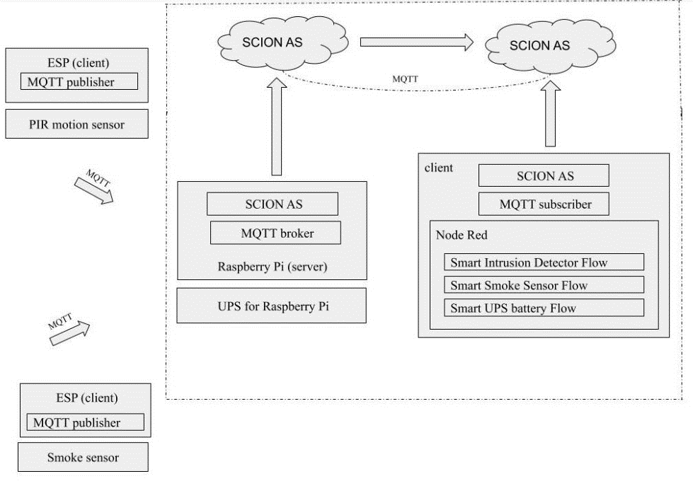

## Auto Burglar Detection and Data analytics with PIR Sensors, MQTT Protocol and Machine Learning over SCION


There are several Internet of things (IoT) applications running on legacy networks which are not flexible in terms of path selections, network outages and security concerns. Thus, the current situation demands switching over to a new network platform which is highly scalable, secure, and isolated in terms of its architecture. Thus, a basic IoT application is being attempted which will use Scalable Control and Isolation on Next generation networks (SCION) architecture and hence, surpasses the existing concerns on the current network protocols. The chosen Internet of things (IoT) application is based on Automatic	Burglar   Detection, where   an	Intruder is identified without  indulging camera setups and rather employing optimal motion sensor, mac ids and virtual switches.The implementation involves a simple client server architecture where there are 2 clients connected to a single server (Raspberry pi) running a SCION AS instance and MQTT broker. The ESP module with PIR sensor act as one of the clients publishing values to the server (Raspberry pi) via MQTT protocol. The SCION AS enabled local machine being the other client and the user interface to the user connects to the server (Raspberry pi) via MQTT over SCION sig configuration. The key process includes


* The Raspberry pi configuration as sever with MQTT broker and a SCION AS instance.
* The client ESP module integration with PIR sensors and publication of motion detection over MQTT protocol to the SCION AS enabled Raspberry pi server. 
* The other client side, SCION AS enabled machine subscription and data accumulation from  the server (Raspberry pi) via MQTT protocol running over the SCION network.

<br/>



 

## COMMUNICATION FLOW

* The PIR motion sensor is coupled with ESP module so that motion data from the PIR sensor is sent over **MQTT** protocol (WiFi) through an ESP module as a MQTT message “**Motion/Voltage**” to the MQTT broker installed at the raspberry pi end with topic “**/feeds/motion**”. The ESP module is configured to act as a MQTT publisher which publishes the message “**Motion/Voltage**” to the MQTT broker installed at the raspberry pi end whenever a motion is being detected by the PIR sensor.
* A SCION AS is configured to run on the pi which provides the SCION Internet Gateway (SIG) through specific defined ip addresses. The MQTT broker installed at the raspberry pi end will be always listening on the port 1883 of the pi's network interface. The ESP module publishes the MQTT messages to the pi on a particular topic '/feeds/motion'. Upon receipt of this MQTT message at the defined ip address and port 1883 of the pi, the MQTT broker at the pi end will forward this message to the respective subscriber (local remote machine running another defined SCION IP address)  who is subscribed on this topic via MQTT over SCION network.
* This MQTT message from the PIR motion sensor acts as the trigger point and captures the instantaneous mobile MAC data and online switch data along with the timestamp.
* This data is logged in two different csv files namely **trainingdata.csv** and **datalog.csv**. The datalog.csv acts as the source file for historical data analysis and is uploaded weekly to the InfluxDB for the same in a
  specific format whereas the trainingdata.csv acts as the source file for training the LSTM model and the model is trained on a monthly basis. Hence, the datalog.csv is refreshed on a weekly basis and the trainingdata.csv is refreshed on a monthly basis. The training data.csv is also used for the statistical approaches and providing the weekly summary detection report.
* The motion data, mobile mac data and the online switch data is visualized using **Grafana** and the predictions results are visualized using the **Node-Red dashboard**. Whenever the prediction results suggests an abnormal intrusion behavior, an email notification is sent out to the user.
<br/>


## HARDWARE INTERFACING

### ESP8266 (Wemos) with Sleep PCB Circuit and Physical Switch

The above circuit has been designed to put the ESP in deep sleep mode when not in use and its corresponding PCB circuit has been developed. With this PCB circuit we were able to cut down the power usage of ESP hence saving the battery life. The module wakes with an interrupt which is nothing but the detected motion which would further publish a MQTT message and goes back to sleep.
The WiFi network is never constant and it is required for the ESP to connect to different Wi-Fi networks/broker/topic dynamically as per our needs. Technically, it’s a repetitive task as the program needs to be burned to ESP using Arduino every time, to connect to a new Wi-Fi network. This concept has been made super easy with the Wi-Fi manager library. Every time the code is burned into ESP (without Wi-Fi cred) it creates a mount point (server) which can be accessed for setting all the parameters (Wi-Fi/topic/broker). Once the ESP is reset, next time it connects to the parameters that were set in its configuration file earlier.
Whenever there is a need to edit any of these parameters the ESP is required to create a mount point so that the parameters could be reconfigured. A small two-way physical switch has been implemented to realize this functionality. When the switch is turned on (set high) it resets all the parameters in the ESP config file and hence creates a mount point. Once all our parameters are set, the switch needs to be turned off (set low) so as to save the parameters. This process can be repeated to wipe out all parameters and set again.
Also, as an enhancement, the hardware switch (indicating person presence) has been replaced with an online switch so that the user could have an access to it via the webpage rather than expecting the user to enable and disable the switch physically. This is achieved by the “Online switch node” configured in Node-RED. The switch can be turned on/off via Node-RED UI.
Apart from switch functionality, Address Resolution protocol (ARP) has been incorporated in the application which is realized using the ARP node in Node-RED. The mac id of the user’s mobile is specified in the ARP node. Whenever, the user’s mobile is connected to Wi-Fi at his presence, the ARP outputs a value of “1” indicating that the user is at home.
<br/>

## DATA ANALYSIS APPROACHES

### <ins>Historical data analysis</ins>

#### Logging Data

This approach involves the periodical querying of a InfluxDB database containing the historical data (timestamp data, week index data, time index data, motion data, online switch data,mobile mac data). This historical data in the InfluxDB database is updated on a weekly basis. In every five minutes, a query is passed to the database to return the number of detections for that five minute interval from the historical data which conveys the usual number of detections that normally happen on that day, for that five minute interval.This query result is then compared with the current number of detections observed in the current five minute interval. The detailed description of this approach is as follows:


When the MQTT message “Motion/Voltage” is received at the server end which as the MQTT subscriber, the corresponding online switch data and the mobile MAC data at that instant of time is extracted. The MQTT message is fetched using the “mqtt in” node which is configured by providing the ip address of the raspberry pi “ 	” and the topic of the MQTT message “/feeds/motion”. The MQTT message “Motion/Voltage” is then further mapped as 1. The online switch value is extracted using the “switch” node which is a toggle button representing “0” at OFF state and “1” at ON state. The mobile mac data is derived from the “ARP” node where the MAC id of the user’s mobile is specified so that this MAC id is checked in the ARP table of the home’s network. Presence of the MAC id corresponds to “1” and absence of the same corresponds to “0”. As a result, the motion data will be always “1”, the online switch value will be either “0” or “1” and the mobile mac value will be either “0” or “1”. All these data are then combined together along with the corresponding timestamp and is logged in a csv file,datalog.csv. An entry in the log file only happens upon a motion detection and on further receipt of the MQTT message”Motion/Voltage” at the server end The format of the datalog.csv is as shown below 


#### Uploading logged data to InfluxDB

This datalog.csv file acts as the basis file for the historical data analysis.This datalog.csv file is then uploaded to the InfluxDB database “historicaldb” on a weekly basis and hence, the datalog.csv file is also refreshed on a weekly basis to avoid duplicate data being uploaded to the “historicaldb”. A retention policy of six months is applied on the database so that the historical data older than six months are automatically removed from the database as the time progresses and eventually, the database will only contain the recent historical data.
The datalog.csv file is uploaded to “historicaldb” in a particular format by passing the data over a series of python scripts namely “timestamp_formating.py”, “timestamp_influxconversion_format.py”	and “timestamp_influx_lineprotocol_format.py”.

The input data to “timestamp_formating.py” is of the format:


 
Which is then transformed into the format as below:


The “timestamp_formating.py” script aggregates the datalog.csv on a five-minute interval basis such that the timestamps are in five-minute intervals in the sequence dd/mm/yyyy hh: 00:00, dd/mm/yyyy hh:05:00, dd/mm/yyyy hh:10:00 and so on.


The script also derives the WDay and the time index from the date and time information of the timestamp respectively. The weekday, WDay is derived from the date information of the timestamp ie 1 for Sunday, 2 for Monday, 3 for Tuesday, 4 for Wednesday, 5 for Thursday, 6 for Friday and 7 for Saturday. Hence, the WDay value will be any value between 1 and 7. The time index value is also derived from the time information of the timestamp. The time index value is the incremental value for every five minutes starting from 0 to 287 such that the first five minutes of a day (00:00:00 - 00:05:00) corresponds to 0 and the last five minutes of a day (23:55:00 - 00:00:00) corresponds to 287.Thus, the time index will have values ranging from 1 to 287 as a day contains 287 five- minute intervals.

As a result, an entry in the output file conveys the following information: five minute interval timestamp, the WDay which tells the day when the motion was detected, time index which tells five minute interval on that day, motion which tells the number of times, motion has been detected for that five minute interval on that day ,the online switch and the mobile mac value for that five minute interval on that day.

The “timestamp_influxconversion_format.py” script converts the timestamp into the corresponding UNIX timestamp format.


The "timestamp_influx_lineprotocol_format.py" transforms the existing format to a particular line protocol format such that the data suits to be fed into a measurement “sensor” within the “historicaldb”.The output file from this script is then fed to the InfluxDB “historicaldb” using the InfluxDB API POST request. The data gets updated in the “historicaldb” as follows:


The weekly_influx_upload.sh is run weekly using the crontab services which is scheduled to run on every Sunday at 23:20:00 so that the historical data update happens automatically every week. and the datalog.csv is also refreshed weekly so that every week’s datalog.csv gets uploaded to the “historicaldb” to avoid duplicate upload.

`20 23 * * 0 /bin/sh /home/pi/weekly_influx_upload.sh` is the cron job.


#### Historical Search logic

In every five minutes of a day, a SELECT query is passed to the “historicaldb” to return the number of detections happened for that five minuteon that day. This is done using the “primary historicalsearch.py” script which is embedded within the “Python Shell” node in the Node-Red.


In every five minute of a day, the instantaneous timestamp is passed as arguments to the “primary historicalsearch.py” script.This script takes this timestamp and derives the respective current WDay and current time index from the timestamp information.So,the week index will be any value between 1 to 7 and the time index will be any value between 0 to 287.
The “historicaldb” already contains the historical data in the format (timestamp,WDay, time index,detections, online switch, mobile MAC). The script then passes a couple of select queries on this historical data :

•	"Select the “sum”of detections from”historicaldb” where time index = current time index and WDay = current WDay "

o	This will fetch out the total sum of
detections that happen on this particular week day and time index. This value is nothing but the sum of detections that happen in a five minute interval on specific week day.

•	"Select the “count” of WDay from ”historicaldb” where time index = current time index and WDay = current WDay"

o	This will fetch out the count of specific WDays existing in the “histroicaldb”

The division of the two results corresponds to the usual number of detections that happen on a five minute interval of a specific day based on the historical data. This corresponds to the historical five minute detections value.

In every five minute, the number of times , the MQTT message “Motion/Voltage” being received at the “mqtt in” node is counted. This value corresponds to the current five minute detections value.

This historical five minute detections value and current five minute detections value are compared with each other on a function node. If the current five minute detections value exceeds the historical five minute detections value by a nominal percentage,then the situation can be considered as abnormal situation and the situation is classified as a "Chance of Intrusion" and otherwise as “Peace”.


If an abnormal situation or "Chance of Intrusion" case arises, the current online switch value and current mobile MAC value are taken into consideration and different cases are formulated based on their value as follows:


The message corresponds to “Detections are observed or check your dashboard to see if the switch value and mobile MAC value is correctly configured or not“. This message is displayed in the NodeRed dashboard.

This corresponds to the historical primary search.

If both online switch and mobile MAC are in HIGH state, a SELECT query is passed to the script “secondaryhistoricalsearch.py” embedded in the pythonshell of Node-red along with the current timestamp value as arguments.The script takes this timestamp and derives the
 respective current WDay and current time index from the timestamp information.The script passes a couple of queries to the “historicaldb”

•	"Select the “sum”of detections from”historicaldb” where time index = current time index and WDay = current WDay " and mobile mac = current mobile mac and online switch = current online switch value.

o	This will fetch out the total sum of
detections that happen on this particular week day and time index if the person is present at home. This value is nothing but the sum of detections that happen in a five minute interval on specific week day at user’s presence. The result can be even empty which indicates that the passed timestamp does not exist at all at user’s presence in the historical data.

•	"Select the “count” of WDay from ”historicaldb”
where time index = current time index and WDay = current WDay”.

o	This will fetch out the count of specific WDays existing in the “histroicaldb”

The division of these two results corresponds to the usual number of detections that happen on a five minute interval of a specific day when the person is present based on the historical data.This corresponds to the historical five min detections.The number of times , the MQTT message “Motion/Voltage” being received at the “mqtt in” node is counted in every five minute which corresponds to the current five minute detections value. Both these values are compared against each other as follows:


This corresponds to the historical secondary search.

The result status of the primary and secondary search is displayed at the node red dashboard for user reference which displays and refreshes the status in every five minute interval. Despite of that, whenever an abnormal situation arises, the respective message is sent out to the user via an email notification.
### <ins>Statistical methods</ins>
 
Two statistical methods are used to derive relevant  information from the logged data ,trainingdata.csv.

### Standard deviation method

Since the data is only logged in the trainingdata.csv file whenever a motion is detected, the timestamps logged in the dataset will be the timestamps of motion detection and the motion value logged in the dataset will be always “1’ as follows :


The script “stdprediction.py” transforms the datalog.csv into another format as follows


The script also filters the dataset by applying the selection condition such that online switch value = 1 , mobile MAC value = 1 and motion = 1.


Hence, the dataset only contain the corresponding WDay and time indices when the person is present and when the motion is detected which indicates the time periods of motion detections at users presence.

The script groups the motion detected time indices with respect to the WDay values such that the motion detected time indices of the WDay 2, Monday is stored in one list and the motion detected time indices of the WDay 3, Tuesday is stored in another list and so on. As a result, the motion detected time indices of each day is stored in each specific list or each group.


The mean and standard deviation of the time indices of each WDay is calculated dynamically with every new detection that happens logged in the csv file. The cut off limit is defined as the thrice times the standard deviation. Likewise, the upper and the lower cut off limit with respect to the standard deviation value is calculated for each WDay. These values gets changed dynamically when a new detection gets logged into the csv file. This logic is implemented on the script which runs on every detection that happens.On every detection, the instantaneous timestamp is passed as arguments to the script which triggers the script to run and the respective week index and time index is derived from the timestamp.

The current WDday specifies the list to be checked , that is the WDay to be checked and if the current time index exceeds the upper cut off limit or fall short of the lower cut off limit of that WDay, then the situation is regarded as an abnormal situation like chance of Intrusion otherwise is regarded as a peaceful situation.


### Interquartile region method

The trainingdata.csv acts as the source file for this method.

The script “iqrprediction.py” transforms the datalog.csv into another format as follows :


The script also filters the dataset by applying the selection condition such that online switch value = 1 , mobile MAC value = 1 and motion = 1.


Hence, the dataset only contain the corresponding WDay and time indices when the person is present and when the motion is detected which indicates the time periods of motion detections at users presence.

The script groups the motion detected time indices with respect to the WDay values such that the motion detected time indices of the WDay 2, Monday is stored in one list and the motion detected time indices of the WDay 3, Tuesday is stored in another list and so on. As a result, the motion detected time indices of each day is stored in each specific list or each group.


The interquartile region, upper whisker, lower whisker , upper quartile, lower quartile and mean of the time indices of each WDay is calculated dynamically and stored with every new detection that gets logged in the datalog.csv file.These values gets changed dynamically when a new detection gets logged into the csv file. This logic is implemented on the script which runs on every detection that happens.On every detection, the instantaneous timestamp is passed as arguments to the script which triggers the script to run and the respective WDay and time index are derived from the timestamp. If the passed current time index of a particular WDay is greater than the upper whisker/ upper quartile or lesser than the lower whisker/lower quartile or not within the interquartile region of that WDay, then that passed timestamp is regarded as an abnormal situation, that is Chance of Intrusion otherwise is regarded as a peaceful situation.


### <ins>Machine Learning Approach</ins>

Since the application deals with motion and time series, it was decided to choose one of the best suited Time series forecasting model for the Machine Learning functionality. The idea is to track, predict and compare the new motions instances with past occurred instances . The motion data is un- structured, huge and pattern less data (having bigger duration gap length). So LSTM with its capability to remember past data even older ones, was the perfect choice. Apart from these, the lack of many training parameters, for instance in our case, time and motion values are only the parameters that are passed to the machine learning model. LSTM is preferred in such univariate time cases with plethora amount of data.
Whenever there is a motion detected, from the sensor, the data is recorded in the client side (Node-RED) as Timestamp : mm/dd/yy HH:mm:SS and motion value as “1”. This is the data format which is fed into our machine learning model as the input for training.

The machine learning model was built with 67 percent of motion data (timestamp aggregated as 5min duration and the corresponding motion values for the duration is added.) as training set and remaining set of test data was used to validate the same. The other parameters used to train model was

Batch Size : 1 Epochs : 1500
Neurons : 4
Loss : mean_squared_error Optimizer: adam

The LSTM model obtained was quite satisfactory with the RMSE score of 1.6 as per test data validation given below where the orange plot refers to the predictions.


The model was saved offline using appropriate libraries and used for real time prediction by inputting real time motion values. This practical move was achieved by creating a Flask application (ML server) based on python where we would load the model once when the server is run initially. The server is
good to accept API calls which in turn are motion values. These motion values obtained are passed to the model where it would predict the next motion value( for next 5 min). The output of the model which is the predicted value is fetched back to the client and compared with the real time motion value from the sensor in that specific instance. Based on the variation of the values it is decided, if it’s a Intrusion or Motion caused by the user. The application server is enabled as a service “ modelstart.service” which is autorun every time the machine boots. Also the service restarts monthly once the training is completed to invoke and load the newly obtained model.


#### Working of LSTM prediction based on Node-red implementation

The PIR_MQTT node in Node-RED is connected to the broker installed in pi via Scion protocol. Whenever the data is sensed by the sensor, the ESP publishes value “Motion/ (battery voltage)” onto the mosquito broker installed in pi. The PIR_MQTT node in Node-RED (Client VM machine) subscribed to the same broker and topic in pi (data transfer between remote systems via Scion sig protocol) receives this data instantly and feeds it to the member nodes. Based on this, the battery status and the motion value is processed. This motion data is saved in a CSV file “ Trainingdata.csv” which is used monthly to train the model. The training duration is up to every user and also depend on the accuracy of the model obtained.
As discussed, in case of motion, the Node-RED detects the motion value as “1”. Now since the model was trained with the data aggregated for 5min interval, the model predictions will always be for future 5 mins. Hence during a motion, the real time motion values across last 5 min interval is fed into LSTM to predict motion value for next 5 min interval. As discussed this is done by running a python file in “Python shell node” in node-red. The script would take the motion value as its input argument and make an API call to our Flask application server where the model is loaded and running. This value is fed to model for the prediction. The predicted value is fed back as the output of the script. This predicted value from the python shell is put in a register and compared with the real time motions at next 5min interval end. Based on the deviation or the overlapping of data, the final decisions are made.


After comparison of real time and predicted values, a difference of these values are calculated. If the difference is greater than 5 motions (which is a customization parameters and could vary with different applications and users), the final decision from the Machine learning side as Intrusion. The output decision/response again depends on the value of ARP and online switch obtained. Again this decisive part depends on person to person who can customize the algorithm as per their choice
If the output from LSTM is in a considerable range (threshold 5 motions) it is concluded as “Peace” ignoring switch and mac values.
However if the output from LSTM is considerably deviated from the normal range, then the decision is based on the obtained switch and mac values

•	Switch = 1 Mac = 1 message : No chance of  Intrusion as Switch and Mac configured rightly

•	Switch = 0 Mac = 1 message : Detections are observed. Either Switch/Mobile misconfigured, Else Inrusion

•	Switch = 1 Mac = 0 message : Detections are observed. Either Switch/Mobile misconfigured, Else Inrusion


If the decision turns out to be any of the above 3 other than “Peace” (from the machine learning side) the user is notified by an alert mail sent to their respective mail id. This is done using the mail node in Node-RED.

## REPORTS

### <ins>Weekly Detection Summary</ins>

The trainingdata.csv acts as the source file for this application.

The script “weeklysummary_boxplot.py” transforms the trainingdata.csv into another format as follows:


The box plot maps the time indices values with respect to the WDay value. In other words, the script creates the box plot for sunday by considering the time indices belonging to the WDay
= 1 and creates the boxplot for Monday by considering the time indices belonging to the WDay = 2 and so on. This process is iterated for every week so that daily box plots of each of the week is obtained. A week’s box plot summary comprises of boxplots of Sunday, Monday, Tuesday, Wednesday, Thursday, Friday and Saturday. The Summary consists of box plot of the last four weeks. The script is scheduled to run daily at 21:00:00 using the crontab services as shown below:

`00 21 * * * /bin/sh /home/pi/weeklysummary_boxplot.py` is the cron job


### <ins>Model Training Report</ins>

The report indicates the characteristics of obtained trained LSTM model.


## IMPLEMENTATION OF GUI

The flow- based, visual programming development tool, Node-Red [6] has been employed for this purpose. Several types of nodes has been used and configured accordingly for several use cases like to retrieve the MQTT message over the SCION network, to realize the online switch functionality, to realize the ARP based mobile mac functionality, to run the python scripts at real time, to customize and parse the data, to provide dashboard facility for the users and so on. The most important nodes and it’s configuration and it’s requirement has been discussed below

•	“MQTT In”, a network node which is configured with the raspberry pi’s ip address/ scion instance (MQTT broker) so as to receive the MQTT message ‘Motion/Voltage’ whenever motions are being detected.

•	“Switch”, a dashboard node which provides a switch functionality at the node red dashboard so that the user can either turn ON or OFF depending on his presence at home.

•	“ARP” node, a network node which provides the content of the ARP table with which we can detect the ip address and the MAC address of the devices connected in the network. The node is configured by specifying the MAC address of the user’s mobile. This tells if the user’s mobile is connected to the network by checking if the MAC address of the mobile is present in the ARP table.

•	“Join”, a sequence node which is used at several instances to combine the different messages together so that certain functionalities and comparison checks can be made among the different messages being received.

•	Custom “Function”, a function nodes which is used to parse, format the messages being received, to create custom context dependent functionalities and comparison checks with the messages.

•	“Python shell”, a input node which has been used to run the python scripts upon triggering of the node. The node gets triggered whenever it receives a input which can be also passed as arguments into the python script. The python shell has been used to run various scripts which gets triggered on motion detected timestamps (weeklysummary_boxplot.py,		iqrprediction.py, stdprediction.py) or every five minute intervals(primaryhistoricalsearch.py), every five minute current detection value ( 	).

•	“Email, a network node which is used to sent an email notification whenever any abnormalities in detections are observed at peculiar timings based on the implemented approaches. The node is configured by specifying the email credentials of the user.

•	“Csv”, A parser node to parse the data in the csv format which has been used to log the data being received: t imestamp, PIR motion data, online switch data, mobile mac data in two different csv files namely datalog.csv and trainingdata.csv. The former acts as the source file for InfluxDB upload and the latter acts as the source file for various already discussed approaches.

•	Dashboard nodes which comprises of text nodes, gauge nodes, chart nodes has been used to serve the purpose of visualization to the user so that the user is able to know the live status of the home remotely.


This acts as a Graphical User Interface for the users so that they can monitor the live status of the home remotely. On this GUI, the user can control the online switch value based on his/her presence. He/She can turn the switch to either ON or OFF based on his presence/absence. Whenever any email alerts are sent to the user stating any abnormalities, the user is able to monitor the system from any remote location.


## TOOLS AND HARDWARE IMPLEMENTATION SETUP


### PCB AND ESP8266 Installation

* Install Arduino [IDE ](https://www.arduino.cc/en/main/software) to configure and burn the code into ESP8266 module.
* Setup the hardware PCB and physical switch (for WiFi manager reset functionality with respect to ESP8266) as per PCB gerber files with sleep mode setup. Burn the respective Arduino code into ESP8266. 


### RASPBERRY PI Installation

* Install [Raspbian ](https://www.raspberrypi.org/downloads/raspbian/) OS across Pi.
* Install Python3,Python3 virtual [environment ](https://packaging.python.org/guides/installing-using-pip-and-virtual-environments/) (running python scripts in node-red exclusively using python3 environments), ideal Python IDE, Flask [framework](https://www.fullstackpython.com/flask.html) in Raspberry Pi (If we intend to train and run the model in Pi).
* Node Red was used for implementing data flows and interfacing data connections across systems.Please refer the [link ](https://nodered.org/#get-started) and setup Node-RED in host systems where we tend to visualize the data. (If we tend to visualize the data and establish in Node-RED in Pi)
* Install Mosquitto [Broker  ](https://appcodelabs.com/introduction-to-iot-build-an-mqtt-server-using-raspberry-pi) for MQTT protocol.
* Set up SCION [SIG  ](https://code.ovgu.de/hausheer/scion-iot/tree/master/UPS_Failover/setup_sig) gateway connection protocol across Pi.


### PARENT/REMOTE/HOST SYSTEM INSTALLATION

* Install any Linux based OS. (Ubuntu/Ubuntu Server highly preffered)
* Install Python3 ,Python3 virtual [environment ](https://packaging.python.org/guides/installing-using-pip-and-virtual-environments/) (running python scripts in node-red exclusively using python3 environments), ideal Python IDE, Flask framework in Raspberry Pi and all the required libraries like Keras, TensorFlow and Numpy if we intend to train and run the machine learning model in the host system.
* Install Mosquitto Broker across host system to subscribe to the broker set up in Pi and receive the messages.
* Node Red was used for implementing data flows and interfacing data connections across systems.Please refer the [link ](https://nodered.org/#get-started) and setup Node-RED in host systems where we tend to visualize the data. (If we tend to visualize the data and establish in Node-RED in Pi)
* Set up SCION [SIG  ](https://code.ovgu.de/hausheer/scion-iot/tree/master/UPS_Failover/setup_sig) gateway connection protocol across host system to connect to SCION SIG established in Pi.
* Set up Influx [db  ](https://docs.influxdata.com/influxdb/v1.7/introduction/installation/) in host sytem for storing local data.
* Install [Grafana  ](https://grafana.com/docs/grafana/latest/installation/debian/) to visualize and plot the weekly/monthly motion data fetched across host system.


## PROJECT INSTALLATION STEPS

* Clone the repository.
* Make sure that the necessary software tools and hardware is implemented and installed in their respective subsystems.
* Once the PIR-sleep-switch hardware is setup, burn the Arduino code **MQTT_ESP_Bat.ino** to the ESP8266 to publish MQTT messages whenever a motion is detected.
* Install Raspbian OS in pi and set up MQTT broker as listed in Raspberry pi for the ESP8266 to publish.
* Install Node-RED, Flask frameowrk and all machine learning libraries if you intend to run and visualize the data in pi. In our scenario we have used pi as Mosquitto broker just for transmitting data to host sytems.
* Set up SCION sig in pi so that the remote host systems could connect to it via MQTT over Scion IP gateway .
* Post Raspberry pi configuration, set up the local host system with Node-RED and Flask framework.
* In Node-RED import the flow and paste the Flow.json file present in the cloned directory.
* Set up a Python3 environment in the host machine and navigate it accordingly in python shell node running in node-red flow.
* Check the SIG connection and configure the MQTT node with local SIG ip of pi to establish a MQTT connection over SCION.
* The repository consists a sample data file (Motion data for 2 weeks)  that can be populated into Influx db and used for Historical and Search analaysis. This can be replaced by your data if needed.
* Once the Node-RED is set, we move forward to install Influx db and create table. Create a table named "historicaldb"
* Once the table is set we run the script

```
                                            ./weekly_influx_upload.sh
```
                           

* The data should be populated in Influx db and you should be able to query out the data.
* Make sure, all python files rest in the path denoted in the python shell node for a seamless functionality of features. Deploy the node red flow and now we should be able to see the Historical search, boxplot and standard deviation functionalities since they all rely on data stored in Influx db.
* The weekly summary python file alike the above script can be manually run to fetch out the weekly motion data which can ve viewed in Node-RED ui. Please make sure that the path and file names are appropriate.
                          
```
                                            python3 weeklysummary_boxplot.py
```
* To implmenent Machine learning functionality make sure flask framework and all the requisite libraries are installed.Once set, we run the python file 
```
                                            python3 training_lstm.py
```
                            `

Running this file creates a model based on training motion data and saves the model offline "intrusion_lstm_prediction.sav". Feel free to directly use the model given in the repository that has been trained with the given motion data.

* The model's training accuracy details can be viewed in Node-RED ui alike the weekly summary data.
* Once the model is set, we now run a FLask api server where we load the machine learning model and predict the motion values based on input data using Node-red. To start the api server run
```
                                            python3 training_lstm.py
```
                            

                            
 This starts the Flask server and now we should be able to fetch out the predictions when we input motion values using the python file  "apilink.py" that is loaded into Node-Red python shell node.

* The mail node in Node-RED is configured with the respective email address of the user to receive the Burglar Robbery notifications.
* Now that we have set up all nodes and all the application environment, we deploy the node-red flow. Feel free to play with different virtual switch values, mac ids and motion values to see change in output messages across Node-RED ui.
* Lastly we install Grafana and link up our Influx db to it. The data in Influx db can be visualized as per montlhly/weekly stats.
* We have also automated all these functionalities and configurations by incorporating services and cron jobs. The service modelstart.service auto starts the Flask ML Server (LSTM_prediction.py) when the host system is booted. Also the different python files are scheduled at different timings to run.
     * The weekly summart boxplot is scheduled to run every day at 9pm.
     * The weekly influx load is scheduled to run every weekend to load the fresh motion data to influx database.
     * The training lstm is scheduled to run every month to recreate a new efficient ml model based on the latest motion data.
     * The refresh_training script is run after the above step to reset the monthly motion data.

## PROJECT OUTPUT AND RESULTS

* Reception of MQTT messages which are being published from the ESP module on motion detections at the raspberry Pi MQTT broker end.
* Generation of trainingdata.csv and datalog.csv which combines four parameters namely timestamp, PIR MQTT motion message, online switch value, mobile mac value.
* Successful upload of datalog.csv to the InfluxDB database.
* LSTM prediction status based on the current five minute detection value. The model takes the current five minute detection count as the input and outputs the predicted five minute detection count for the next five minute interval and classifies the situation as normal or abnormal by comparing them over a custom percentage.
* Historical Search status in every five minute interval by comparing the current five minute detection count with the past five minute detection count of that respective day which is stored in the InfluxDB “histroicaldb”.
* Statistical methods prediction status in every detection which classifies the detection as normal or abnormal based on the timing of the detection and the usual pattern. It checks if the detected timestamp lie inside or outside the inter-quartile range and if the detected timestamp deviates from the usual median value.
* Weekly summary view which creates a box plot of detected timestamps of each day for four weeks. With this, the user can get a summary of timings when he is usually present/absent at home and can view any abnormal detection (outliers) happened on any day which he never observed at first place and hence, he/she can be cautious for this regard.


### <ins>HARDWARE</ins>


### <ins>NODE RED UI AND MESSAGE OUTPUTS</ins>


### <ins>REPORTS</ins>


### <ins>INFLUX DB</ins>


### <ins>GRAFANA</ins>


### <ins>MAIL NOTIFICATION</ins>


## CONCLUSION

This scientific work focuses on the implementation of a Smart Home IoT use case, Burglar detection system with the use of motion sensor rather than the camera via the SCION network using the SCION IP gateway (SIG). The application involves a client server architecture where the SCION AS instance configured, MQTT broker enabled raspberry pi acts as the SCION AS server which receives the motion data from the remotely placed ESP module coupled PIR motion sensor over WiFi and the SCION AS instance configured local machine acts as the SCION AS client. This application posses wide range of development possibilities by employing more number of motion sensors so that the readings from each motion sensor can be sequenced together to derive the velocity
,direction of movement and even can suggest the approximate number of personnel present in an area. With this, it is possible to identify the intruder in a more accurate way and hence, the accuracy of the burglar detection can be improved. There is no need to employ cameras within the home to detect the burglar presence which is actually a security concern for the user as it disturbs the privacy of the user because the user might have a feeling of insecurity when he becomes conscious of the fact that a camera is being monitoring him continously
